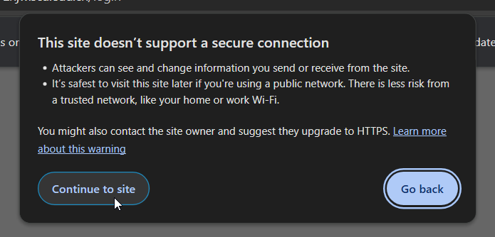

# Schedule Parser
Turn the term curriculum into ics format  
Only tested on SCU URP system  

## How to use
```
python main.py
```
just `ENTER` and login

then u can get the `schedule-whatever.ics`

## BTW
- using gh copilot so maybe >60% code are written by llm
- SCU's management system uses HTTP so just contiune


## how to use from 0
install python and pip 

then
```bash
$ pip install -r requirements.txt
$ python main.py
```
follow the instruction

and get  `schedule-whatever.ics`

put this into ur calender app like google calender
## pack
```bash
$ pip install -r requirements.txt
$ python -m nuitka --onefile --follow-imports --include-package=selenium --output-dir=dist main.py
```